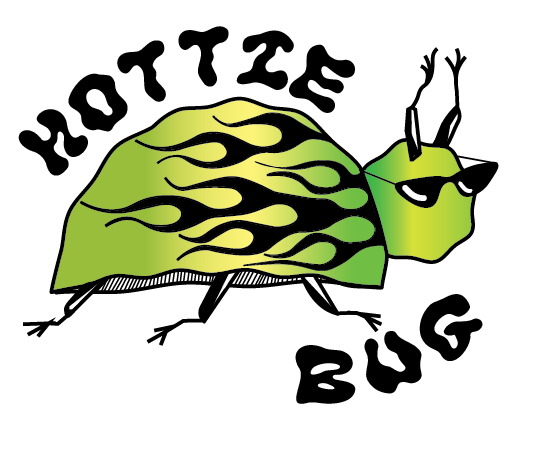

# hottiebug
<html>

<head>

    <!-- THE TITLE WILL APPEAR IN THE BROWSER WINDOW OR TAB -->
    <title>Hottie Bug</title>
    <link rel="preconnect" href="https://fonts.gstatic.com">
    <link href="https://fonts.googleapis.com/css2?family=Source+Sans+Pro&display=swap" rel="stylesheet">

    

</head>

<body>

    

        
        <h1>OUR MISSION IS TO PROVIDE AND INSPIRE FASHION, WHILE KEEPING SUSTAINABLITY AND OUR CUSTOMERS AT THE CENTER
            OF THE HOTTIE BUG UNIVERSE
        </h1>
        <h2>SPECIALIZING IN UNISEXY</h2>

        <nav>
            <ul>
 
                <li><a href="hottiebug brochure.pdf"> FOCO BROCHURE </a></li>
                <li><a href=”https://www.depop.com/hottiebug/” target=”_blank”> DEPOP </a></li>
                <li><a href=”mailto:hottie@bug.com”> EMAIL US </a></li>

             </ul>
                    </nav>

                    </body></html>
